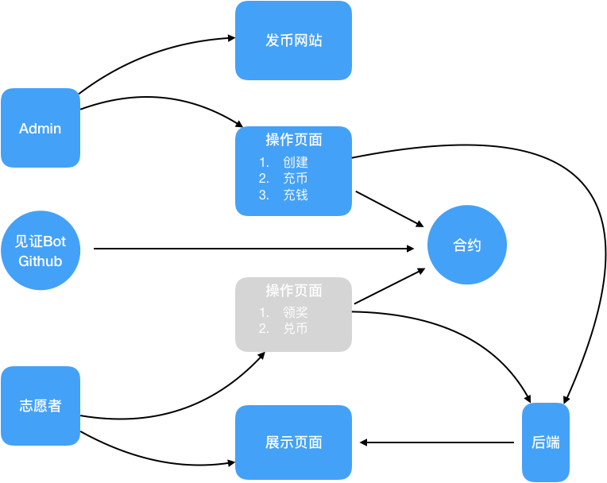
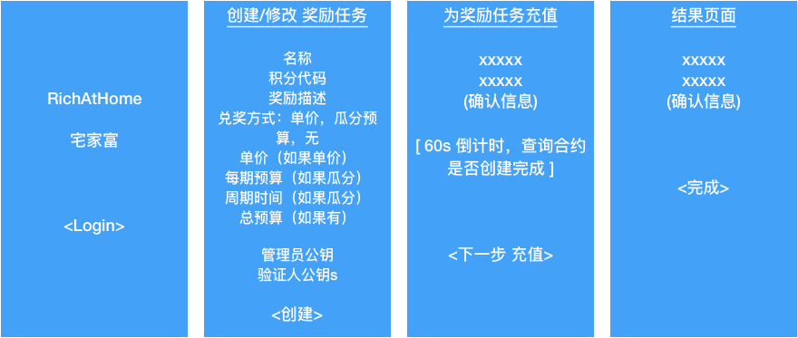
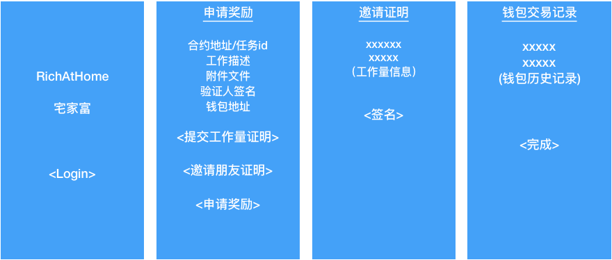
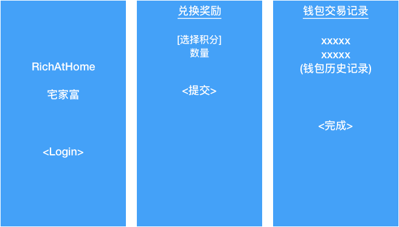
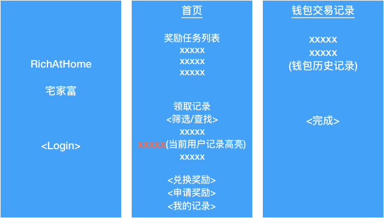
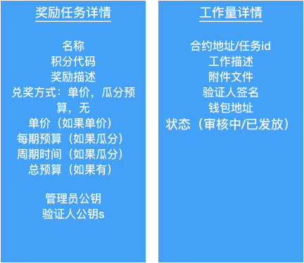

# N11 - 宅富家 Rich@Home - 万向黑客松11号参赛作品

Demo: http://richathome.elapps.net

# 团队 - 宅特工

按加入先后顺序
* 宋世军（产品&架构）
* 徐来（测试）
* 冯占涛（合约）
* 宋家准（前端）
* 陈星燃（后端）
* 胡启明（前端）

# 项目概述

如何在疫情之下，宅在家里还能有效计算工作量、考核工作成果？转换成通用问题就是：人们如何通过互联网有效地远程协作？
我们通过区块链解决大家在不见面、不认识的情况下实现互相信任、有效激励的技术方案。

### 功能

* 非常简单方便即可发行基于区块链的“积分”token，可以将积分用于社区运营中志愿者奖励。
* 可以全自动或者半自动的为志愿者发放积分。
* 管理员可以提供有价的区块链加密货币用于兑换积分，让志愿者可以将积分变成“钱”。
* “换钱“的方法可以是固定积分单价，也可以是大家一起瓜分一个奖金池。

# 一、架构设计
每种积分对应一个独立的“积分托管合约”，它负责保管奖励积分、保管用于奖励的有价token（比如ELA）、为用户发放积分、为用户将积分兑换为有价token。

围绕着积分托管合约，这里面有几个角色：

* **Admin**：管理员代表甲方，创建和管理积分，他可以为奖励对象发行一种奖励积分，再创建一个托管合约来管理它们。同时负责提供兑换积分的“钱”----有市场价的token，例如 ELA。
* **志愿者**：代表普通用户，参与贡献来赚取奖励。完成工作以后需要向合约提交工作量证明信息，并由第三方（类似Oracle）签名，这个第三方是Admin创建托管合约时指定的。得到奖励积分以后，再通过托管合约将积分兑换为“钱”。兑换价格或者兑换方式也是Admin在创建合约时指定的。
* **合约**：即“积分托管合约”，参考前面的介绍。
* **发币网站**：[https://tokens.elabank.net/erc20-generator/](https://tokens.elabank.net/erc20-generator/) 引导用户在这里创建，创建以后会发送到用户的个人meta mask钱包。
* **操作页面**：方便用户调用合约的前端页面，同时也将项目信息、积分信息、领取信息等等都记录在数据库，以备查询使用。
* **展示页面**：可以展示所有的项目和积分，所有的发放记录。可以过滤和筛选。

**附加分----GitHub Hook**

如果有一个奖励是针对GitHub上的行为，可以增加一个GitHub Hook机器人，用户在提交代码或者issue时，在内容里附带自己的钱包地址，机器人发现以后，自动为其签名并调用领取奖励合约，从而实现自动发放奖励。

# 二、页面流程
1. 创建项目

登录页面获取用户钱包信息，包括地址和公钥等。

创建部分调用后台接口，由后端代理创建合约和创建ERC20积分token，并将token充值到项目合约。再由用户自己向项目合约充值ELA，用于为用户兑换积分。

1. 申请奖励

志愿者登录以后获取其公钥和钱包地址。

申请奖励需要四步操作：

1. 提交"工作量证明"到服务器
2. 分享这条工作量证明记录给朋友或者验证人
3. 验证人签名，并将签名提交到服务器
4. 贡献者再次提交“申请奖励”（如果后台可以调用合约，则取消此步骤）

1. 兑换奖励

将积分兑换为奖励，从前端发起合约调用，将积分币转账到对应的项目合约，再由项目合约将对应的ELA转入用户地址，如果是瓜分类型，则等到期之后再转入用户地址。

1. 查看信息

# 三、接口协议
## 1. 瓜分方式积分托管合约
### 方法1: 初始化
1. 管理员公钥
2. 验证人公钥，支持多个
3. 积分币代码
4. 奖励周期时长
5. 每期奖励预算
6. 开始时间
7. 结束时间
### 方法2: 充值积分币
### 方法3: 充值ELA奖励代币
### 方法4: 领取奖励
参数：

1. 收币地址

2. 验证人签名，可以多个

### 方法5: 兑换奖励
功能：记录每个周期兑币的积分数，按积分比例瓜分该周期的ELA数量。可以多次兑换。

参数：

1. 收币地址

### 方法6: 终止项目
功能：自动将剩余积分和ELA退回到管理员地址。

1. 后端接口
1. 备份项目信息

"/api/project", POST , json

入参：

项目信息数据对象全量数据字段

返回：

项目ID，项目项目ID就用合约地址

2. 查询项目

"/api/project/search",POST,json

入参：

Key: 项目ID or 名称 or 发包方名称 or 管理员地址 or 验证人地址 or NULL（为空则返回全部）

PageSize: 每页记录条数

PageNumber: 请求第几页，页码基于0

Order: ASC | DESC

返回：

JSON数组，每个元素是项目对象全量数据

3. 提交工作量证明

"/api/task", POST,

入参：

项目数据对象全量数据字段

返回：

工作量ID

4. 提交工作量证明签名

"/api/task/sign", POST, json

入参：

工作量ID

签名

签名公钥

签名地址

返回：

成功/失败

5. 查询工作量证明记录

"/api/task/search", POST,json

文件是否需要返回？

入参：

Key: 工作量ID or 贡献者昵称 or 贡献者地址 or 项目ID or 项目名称 or NULL（为空则返回全部）

PageSize: 每页记录条数

PageNumber: 请求第几页，页码基于0

Order: ASC | DESC

返回：

JSON数组，每个元素是项目对象全量数据

### 

# 四、数据对象
1. 项目信息
* 项目ID : id
* 名称（50字）:name：string
* 描述（500字）:info：string
* 发包方名称（50字）: sender_name：string
* 发包方链接（1000字）: sender_url：string
* 管理员地址: admin_addressl：string
* 管理员公钥: admin_pubkeyl：string
* 验证人地址（多个）: verifier_address：list
* 验证人公钥（多个）: verifier_pubkey: list
* 积分代币符号: point_token_symbol: string
* 积分数量: point_token_num: string
* 奖励代币符号 :reward_token_symbol: string
* 奖励币数量 :reward_token_num: string
* 兑换周期； exchange_time: string
* 每期预算： budget: string
* 积分兑换价格： rate: string
* 开始时间：start_date: string
* 结束时间： end_date: string
* 合约地址： contract: string
2. 工作量
* 工作量ID : id : string
* 项目ID : project_id : string
* 项目名称 : project_name : string
* 贡献者钱包地址 : contributer_wallet : string 
* 贡献者身份附加信息（200字），用于附加描述贡献者身份，例如github账号，微信账号，邮箱手机等等收集到到信息 : contributer_info : string
* 提交时间 : submit_time :string
* 工作描述（1000字）: task_info : string
* 文件附件（多个）
* 验证人公钥（多个）: verifier_pubkey : list
* 验证人地址（多个）: verifier_wallet : list
* 验证人签名（多个）: verifier_sign :list 
* 状态（已提交，已签名，已发放）: status: string
* 发放交易HASH : tx_hash: string
* 发放时间 : tx_time :string
* 发放积分数量 : tx_token_num : string
